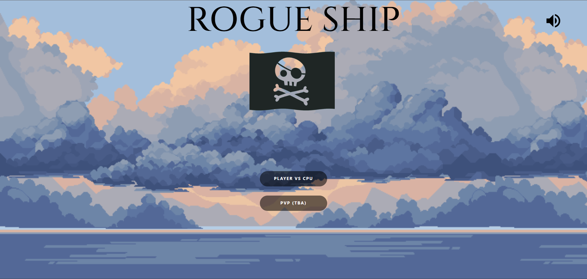
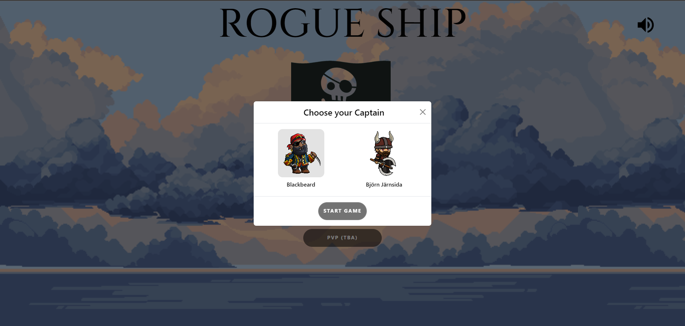
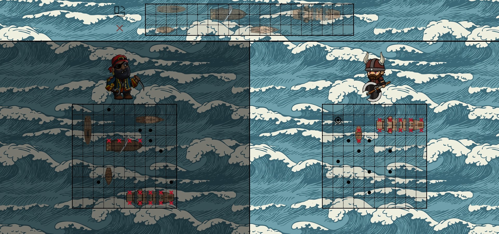

# Rogue Ship

Welcome to Rogue Ship, a thrilling battleship game set in the high seas!

## Getting Started

To play Rogue Ship, simply head over to [RogueShip](https://hammadjka.github.io/Rogueship/)  OR  clone this repository to your local machine and open the `index.html` file found in the `dist` folder. Ensure your audio is enabled to experience the full gameplay experience.

## How to Play

1. Choose your character - Will you lead the pirates to victory, or command the fierce viking warriors?
2. Strategically place your ships on the game board.
3. Take turns attacking your opponent's ships by selecting coordinates on the grid.
4. Sink all of your opponent's ships before they sink yours to win the game!

## Screenshots

## Credits

This game was created as part of [The Odin Project](https://www.theodinproject.com/) curriculum.

